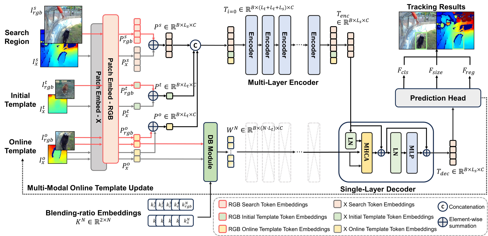
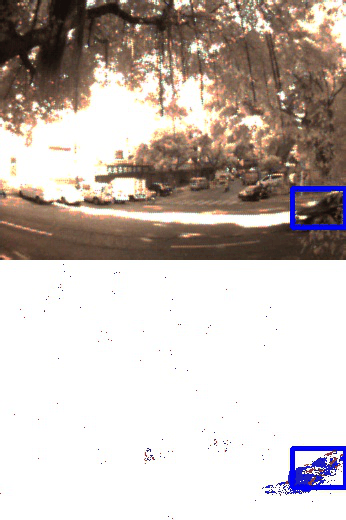

# Efficient Multi-Modal Tracking based on Asymmetric Transformer with Online Domain Blending (ASTR) 


* **Asymmetric RGB-X tracking architecture (ASTR) with a multi-layer encoder and single-layer decoder**
* **Cross-attention between RGB-X search/template tokens, learning global relations across domains**
* **Domain Blending Module: N-token-based joint template learning**
* **Multi-Modal Online Template Update**

## Update
[2024.08.22] Release the evaluation codes

# Usage
## Installation
This code is based on [ViPT](https://github.com/jiawen-zhu/ViPT) and you can install our tracker by refering it.   

Step 1. Install packages
```
pip install -r requirements.txt
```
Step 2. Redefine the path.
```
python tracking/create_default_local_file.py --workspace_dir . --data_dir ./data --save_dir ./output
```

## Prerequisite
* CUDA == 11.1
* Pytorch == 1.8.0

## Data Preparation
Place RGB+X multi-modal testing sets as follow.  
Need to more detailed description, refer to [ViPT](https://github.com/jiawen-zhu/ViPT).

```
$<PATH_of_ASTR>
-- data
    -- LasHeR/TestingSet
        |-- 10runone
        |-- 11leftboy
        ...
```

## Weight and Raw Files
### RGB+T Datasets
|Datasets|Weight Files|Raw Files|Precision Rate|Normalized Precision Rate|Success Rate|
|:----------------------------:|:-----------------------------------:|:-----------------------------------:|:----------------------------------:|:----------------------------------:|:----------------------------------:|
|LasHeR|[link](https://drive.google.com/file/d/12zSlmW5JhGtMhB3Tgi1I3ciLmp8MOCs7/view?usp=drive_link)|[link](https://drive.google.com/file/d/173gQSsSlzIeCzVP2tCA2ebLYOe4QEAFC/view?usp=drive_link)|72.7|68.7|57.6
|RGBT234|-|-|89.5|-|65.1

### RGB+E Datasets
|Datasets|Weight Files|Raw Files|Precision Rate|Success Rate|
|:----------------------------:|:-----------------------------------:|:-----------------------------------:|:----------------------------------:|:----------------------------------:|
|VisEvent|-|-|77.3|60.1

### RGB+D Datasets
|Datasets|Weight Files|Raw Files|F-score|Recall|Precision|EAO|Acc.|Robust.|
|:----------------------------:|:-----------------------------------:|:-----------------------------------:|:----------------------------------:|:----------------------------------:|:----------------------------------:|:----------------------------------:|:----------------------------------:|:----------------------------------:|
|DepthTrack|-|-|60.6|60.4|60.8|-|-|-
|VOT-RGBD2022|-|-|-|-|-|74.4|80.8|90.7


## Training 
It will be released later 

## Evaluation 
Step 1. Download datasets and place it to './data/'.    
Step 2. Download weight file for each datasets.  
Step 3. Implement the commands as follow.    
```
bash ./run/eval_lasher.sh ASTR_rgbt {YOUR_WEIGHT_PATH} # for LasHeR (RGB+T)

bash ./run/eval_rgbt234.sh # for RGBT234 (RGB+T) # To be continued

bash ./run/eval_visevent.sh # for VisEvent (RGB+E) # To be continued

bash ./run/eval_depthtrack.sh # for DepthTrack (RGB+D) # To be continued

bash ./run/eval_votrgbd2022.sh # for VOT-RGBD2022 (RGB+D) # To be continued
```

## Visualization
<p align="center">   
  </p>


# LICENSE
This project is licensed under CC BY-NC 4.0 license. Redistribution and use of the code for non-commercial purposes should follow this license.


# Thanks to
We refer below codes to conduct these experiments.
- [ViPT](https://github.com/jiawen-zhu/ViPT)
- [OSTrack](https://github.com/botaoye/OSTrack)
- [PyTracking](https://github.com/visionml/pytracking)
